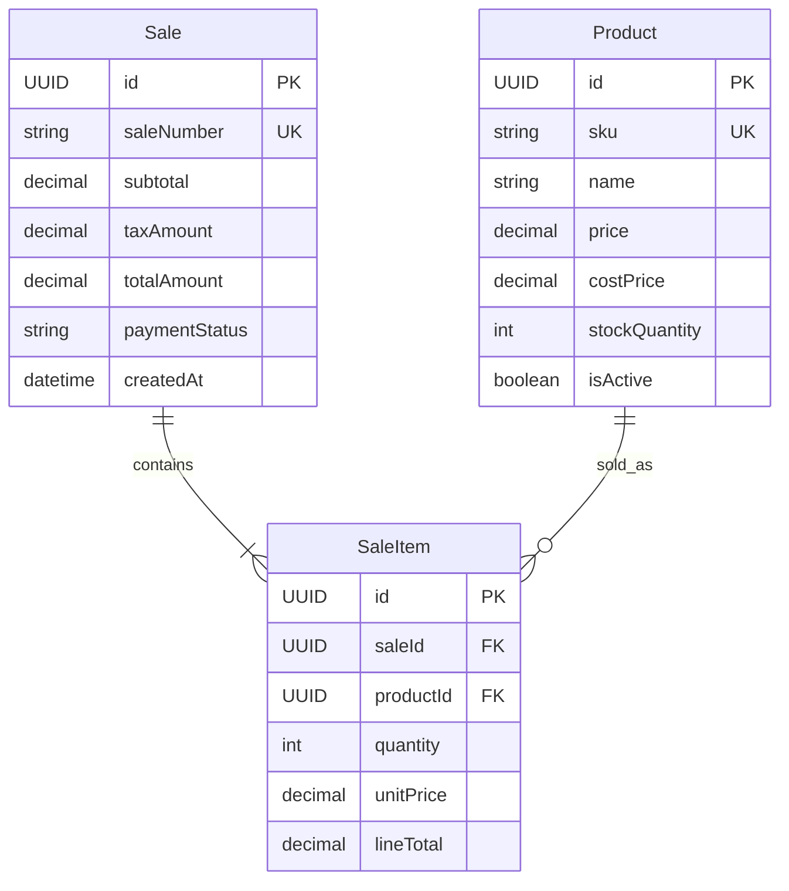
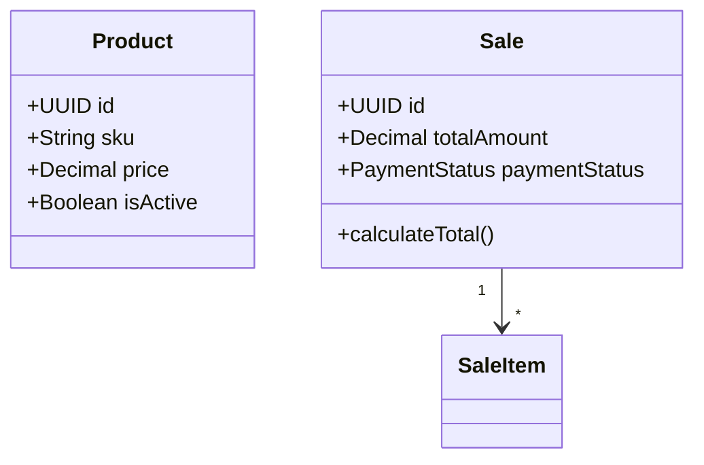

Create a database design that can be implemented, not just a pretty diagram.

## Workflow

1. Identify bounded contexts and durable entities from the product requirements.
2. Separate persisted tables from derived values, service operations, UI-only concepts, and transient workflow states.
3. Choose diagram type:
   - Use `erDiagram` for relational database design.
   - Use `classDiagram` only when the user explicitly wants domain objects, methods, or enums shown.
4. Model fields with implementation-ready types and mark identifiers, foreign keys, nullable fields, money, timestamps, and enums clearly.
5. Add relationships with cardinality and a short relationship label.
6. Add constraints in comments or notes when Mermaid syntax cannot express them cleanly.
7. Review for normalization, lifecycle ownership, delete behavior, audit fields, and indexes implied by common queries.

## Entity Rules

- Prefer singular entity names: `Product`, `Sale`, `SaleItem`.
- Include stable primary keys on persisted entities, usually `UUID id`.
- Add `createdAt` and `updatedAt` only when the implementation layer does not provide them automatically.
- Keep money as decimal fields with explicit names: `subtotal`, `taxAmount`, `totalAmount`, `unitPrice`.
- Store snapshots where history matters. For example, `SaleItem.unitPrice` should preserve the sale-time price even if `Product.price` later changes.
- Use join tables for many-to-many relationships that have attributes or lifecycle of their own.
- Avoid methods in an ER diagram. Methods belong in a class diagram or implementation notes.

## Relationship Rules

- Put foreign keys on the child/owned table.
- Name relationships by business meaning, not database mechanics: `contains`, `records`, `adjusts`.
- Show required vs optional cardinality:
  - `||--|{` one required parent to many required children
  - `||--o{` one required parent to zero or many children
  - `o|--o{` optional parent to zero or many children
- Re-check aggregates: deleting a parent should not accidentally delete financial or audit history.

## Mermaid Patterns

Prefer this for database-first work:

Use this only when domain behavior is the point:

## Review Checklist

- Every child relationship has an explicit foreign key field.
- Every enum has a clear storage strategy, usually a string or small code in the table.
- Unique identifiers are marked, such as `sku` and `saleNumber`.
- Derived totals are either justified as stored snapshots or removed from persistence.
- High-volume lookup fields imply indexes, even if shown as a comment rather than diagram syntax.
- The diagram can be translated into Django models without inventing missing relationships.
