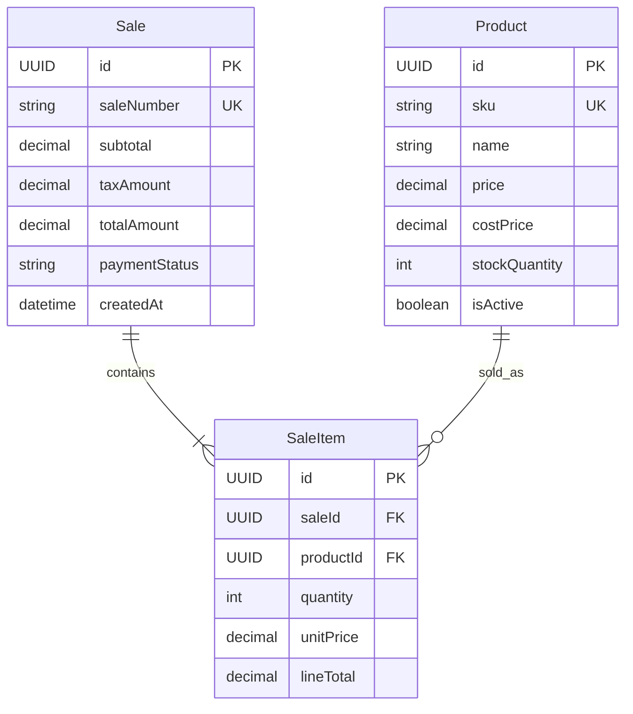

# database-design

Create Mermaid database diagrams that can be implemented cleanly, not just diagrams that render.


If the user gives only a vague feature idea, ask for the missing business rules only when they block the model. Otherwise draft a reasonable first version and call out assumptions.

## Output

Default to `erDiagram` for database design.

## Workflow

1. Extract durable entities from the feature requirements.
2. Remove UI-only concepts, transient states, service operations, and values that can be derived cheaply.
3. Add implementation-ready fields: primary keys, foreign keys, money fields, timestamps, statuses, and enum storage fields.
4. Add relationships with Mermaid cardinality and a short business label.
5. Mark uniqueness, required ownership, optional relationships, and historical snapshots.
6. Add comments for constraints or indexes Mermaid cannot express cleanly.
7. Review whether the diagram can translate directly into Django models without inventing missing relationships.

## Database Rules

- Use singular entity names: `Product`, `Sale`, `SaleItem`.
- Give every persisted entity a stable primary key, usually `UUID id PK`.
- Put foreign keys on the child or owned table: `UUID saleId FK`.
- Mark natural unique fields with `UK`, such as `sku` or `saleNumber`.
- Use join tables for many-to-many relationships that have attributes or their own lifecycle.
- Represent enums as storage fields in ER diagrams, usually `string status`, and list allowed values in a Mermaid comment when useful.

## Relationship Rules

Use cardinality intentionally:

- `||--|{` means one required parent to many required children.
- `||--o{` means one required parent to zero or many children.
- `o|--o{` means optional parent to zero or many children.

Name relationships by business meaning:

For example:
```mermaid
Sale ||--|{ SaleItem : contains
Product ||--o{ SaleItem : sold_as
Product ||--o{ InventoryAdjustment : adjusted_by
```

## ER Diagram Pattern



## Review Checklist

- Every child relationship has an explicit foreign key field.
- Every stored enum has a clear storage type and allowed values are discoverable.
- Unique fields are marked.
- High-volume lookup fields imply indexes, even if written as comments.
- Delete behavior is safe for financial, audit, and historical records.
- The resulting diagram is ready to implement as Django models.
